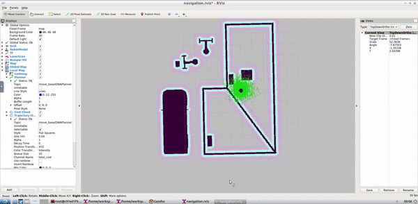

# autonomous-service-bot
This is my implementation of the Udacity Robotics Software Engineer Nanodegree Final Project titled "Home Service Robot". The objective of this ROS project is to simulate a wheeled mobile robot capable of autonomously navigating to pick up and deliver virtual objects.

The following steps were performed:
1. Localizing the simulated robot while simultaneously mapping its environment using the Grid-based FastSLAM approach (gmapping ROS package). This method combines monte carlo localzation with occupancy grid mapping to achieve SLAM using collected laser and pose data.
2. Interface robot location/pose estimates with navigation commands using the ROS navigation stack. The underlying path planner is based on Dijkstra's Graph Search Algorithm.
3. Modeling a virtual object with markers in rviz. The virtual object is the one being picked and delivered by the robot. By subscribing to the robot's pose estimate, it first appears in its pickup zone, and then in its drop off zone once the robot reaches it.


<p align="center">
  
</p>

The contents of this repository form a catkin workspace. The simulation can be recreated by navigating to the shell scripts folder (see directory structure below) and executing the following commands in the terminal:

```
> chmod +x home_service.sh
> ./home_service.sh
```

Directory contents under src :

    ├──                                # Official ROS packages
    |
    ├── slam_gmapping                  # gmapping_demo.launch file                   
    │   ├── gmapping
    │   ├── ...
    ├── turtlebot                      # keyboard_teleop.launch file
    │   ├── turtlebot_teleop
    │   ├── ...
    ├── turtlebot_interactions         # view_navigation.launch file      
    │   ├── turtlebot_rviz_launchers
    │   ├── ...
    ├── turtlebot_simulator            # turtlebot_world.launch file 
    │   ├── turtlebot_gazebo
    │   ├── ...
    ├──                                # Your packages and direcotries
    |
    ├── map                          # map files
    │   ├── ...
    ├── scripts                   # shell scripts files
    │   ├── ...
    ├──rvizConfig                      # rviz configuration files
    │   ├── ...
    ├──pick_objects                    # pick_objects C++ node
    │   ├── src/pick_objects.cpp
    │   ├── ...
    ├──add_markers                     # add_marker C++ node
    │   ├── src/add_markers.cpp
    │   ├── ...
    └──
